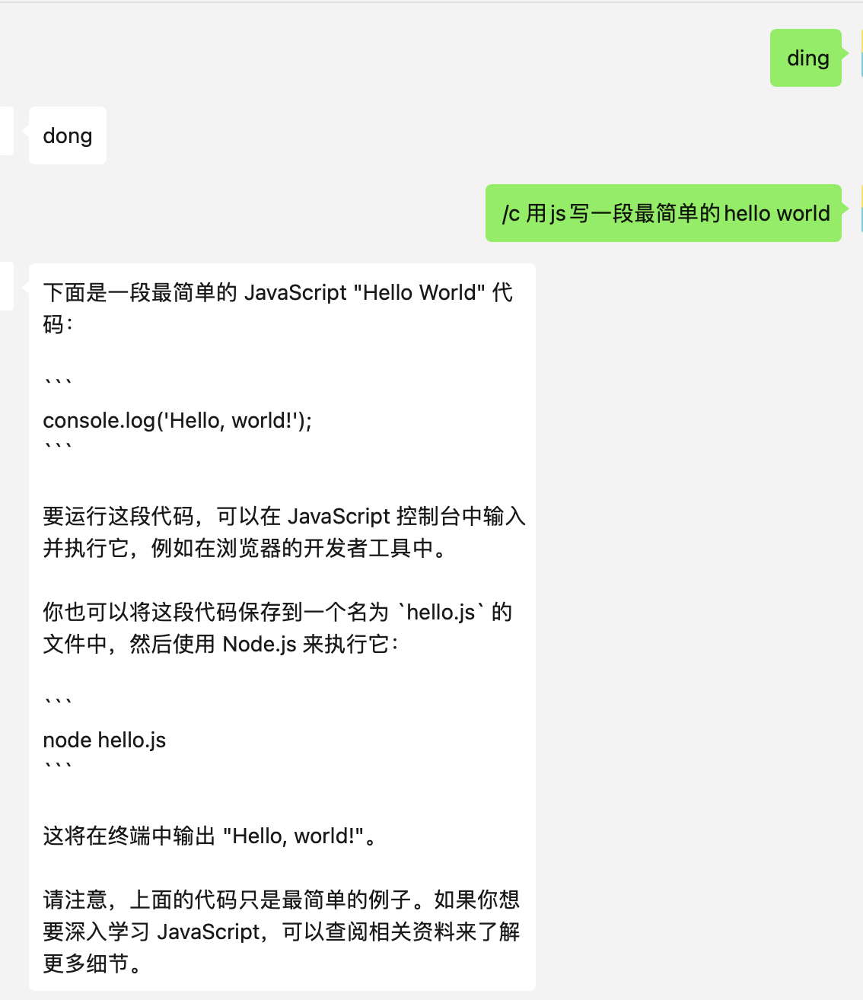

# 基于wechaty创建一个自己的ChatGPT机器人

## 流程

### 注册ChatGPT账号

- 注册地址: <https://chat.openai.com/chat>
- 国内注册教程: <https://juejin.cn/post/7173447848292253704>

### 登录ChatGPT获取SESSION_TOKEN

- 打开网页: <https://chat.openai.com/chat>
- 打开开发者工具->应用->Cookie
- 拷贝`__Secure-next-auth.session-token`的值


### 安装机器人

#### Docker安装

```bash
export SESSION_TOKEN=上一步中拷贝的`__Secure-next-auth.session-token`的值 

docker run -e SESSION_TOKEN="$(echo $SESSION_TOKEN)" --rm -it registry.cn-hangzhou.aliyuncs.com/sunshanpeng/wechaty-chatgpt:0.0.4
```

#### 源码安装

```bash
git clone https://github.com/sunshanpeng/wechaty-chatgpt.git
cd wechaty-chatgpt
```

```bash
export SESSION_TOKEN=上一步中拷贝的`__Secure-next-auth.session-token`的值 
// install dependencies
npm i
// run
npm run chatgpt
```

### 使用机器人

- 扫码登录

- 测试ding-dong
- /c 使用chatgpt


## 感谢

- <https://github.com/wechaty/wechaty/>
- <https://github.com/transitive-bullshit/chatgpt-api>
